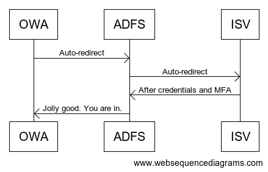

# How to use IBM Security Verify to protect your on-premise Outlook Web Access portal

This how-to guide walks you through how to protect your Outlook Web Access (OWA) portal using IBM Security Verify (ISV).

## How it works

At the time of writing, IBM Security Verify did not support WS-Fed, except if using WS-Fed with Office 365. As such, we need to use ADFS as a proxy to convert IBM Security Verify's SAML authentication over to WS-Fed via a `Claims Provider Trust`. The result is the following sign-in process:

Some IDaaS platforms get around this by having you install an agent on your Exchange server. What's nice about our approach is that it is less invasive. All we're doing is configuring Outlook Web Access to use ADFS, then configuring ISV as a `Claims Provider Trust` so that ISV handles the authentication, not ADFS. 

## Why are we doing it this way?

IBM Security Verify using SAML. Outlook Web Access uses WS-Fed. WS-Fed uses a different protocol than SAML, and the information it needs in the response token is different. 

We use ADFS to translate the SAML response from IBM Security Verify into a WS-Fed response that Outlook Web Access understands. Some of the other popular IDaaS platforms use agents installed on your ADFS or Exchange server(s) to accomplish the same. Having ADFS do this saves you from installing an agent on your Exchange and/or ADFS server(s). One less piece of software you need to patch. Or, monitor for vulnerabilities!